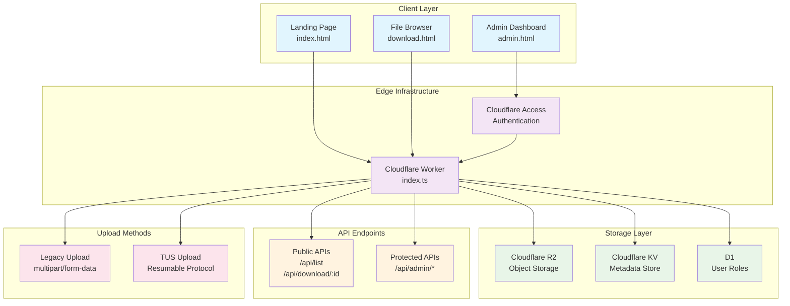
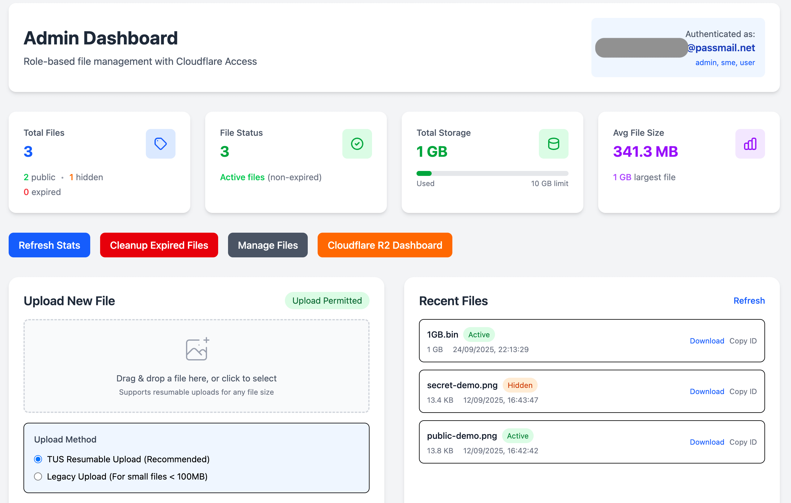
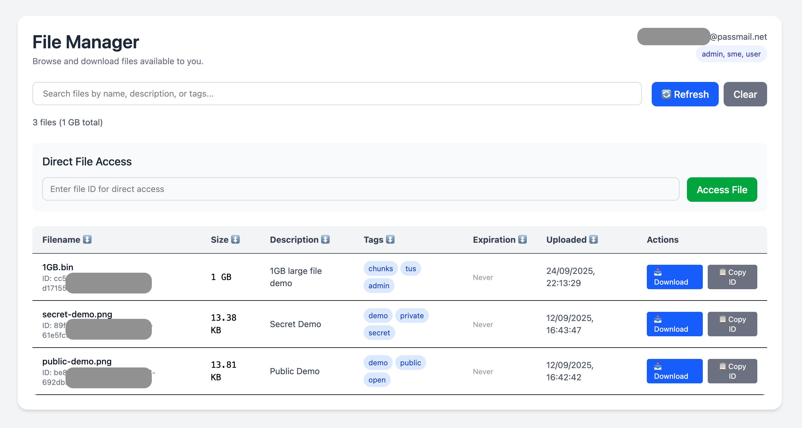
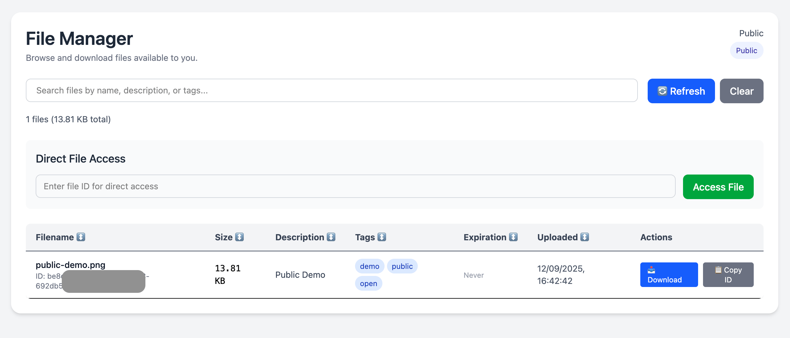

# File Sharing Platform

A modern file sharing platform built on Cloudflare's edge infrastructure. Upload files with expiration dates, privacy controls, and comprehensive admin management.

## Architecture

Built with a modern serverless stack:

- **Frontend**: Vanilla JavaScript, HTML5, Tailwind CSS
- **Backend**: Cloudflare Workers (TypeScript)
- **File Storage**: Cloudflare R2 Object Storage
- **Metadata Database**: Cloudflare Workers KV
- **Security**: Cloudflare Access for authentication
- **Database for User Roles**: Cloudflare D1



## Screenshots

Admin Dashboard


File Manager Admin View


File Manager Public View


## Quick Deploy

[](https://deploy.workers.cloudflare.com/?url=https://github.com/DavidJKTofan/cloudflare-file-sharing-platform)

## Manual Setup

### Prerequisites

- [Cloudflare Account](https://dash.cloudflare.com/sign-up)
- [Wrangler CLI](https://developers.cloudflare.com/workers/wrangler/install-and-update/)
- [Node.js](https://nodejs.org/) (for Tailwind CSS builds)

### 1. Clone & Install

```bash
git clone https://github.com/DavidJKTofan/cloudflare-file-sharing-platform.git
cd file-sharing-platform
npm install
```

### 2. Create Cloudflare Resources

Create the required Cloudflare resources:

```bash
# Create R2 bucket
npx wrangler r2 bucket create file-sharing-platform-files

# Create KV namespace
npx wrangler kv namespace create FILE_METADATA

# Create D1 database
npx wrangler d1 create file-sharing-platform-user-roles
# Upload D1 schema
npx wrangler d1 execute file-sharing-platform-user-roles --remote --file=./1_create_user_roles.sql
```

### 3. Configure Environment

Update `wrangler.jsonc` with your resource IDs:

```jsonc
{
	"kv_namespaces": [
		{
			"binding": "FILE_METADATA",
			"id": "<YOUR_KV_NAMESPACE_ID>"
		}
	],
	"r2_buckets": [
		{
			"bucket_name": "file-sharing-platform-files",
			"binding": "R2_FILES"
		}
	],
	"d1_databases": [
		{
			"binding": "ROLES_DB",
			"database_name": "file-sharing-platform-user-roles",
			"database_id": "<YOUR_D1_ID>"
		}
	]
}
```

### 4. Set Secrets

For enhanced security with expiring files, configure R2 API credentials:

```bash
npx wrangler secret put R2_ACCESS_KEY_ID
npx wrangler secret put R2_SECRET_ACCESS_KEY
npx wrangler secret put R2_ACCOUNT_ID
```

### 5. Deploy

```bash
npx wrangler deploy
```

## Configuration

### Environment Variables

| Name                                                                          | Required | Purpose                                                                |
| ----------------------------------------------------------------------------- | -------: | ---------------------------------------------------------------------- |
| `R2_FILES` (binding)                                                          |       ✅ | R2 bucket binding (object storage)                                     |
| `FILE_METADATA` (KV binding)                                                  |       ✅ | KV for `tus:<fileId>` (in-progress) and `file:<fileId>` final metadata |
| `ROLES_DB` (D1 binding)                                                       |       ✅ | Required D1 DB for role lookup                                         |
| `MAX_TOTAL_FILE_SIZE`                                                         |       ⚪ | Maximum allowed file size (bytes)                                      |
| `MAX_DIRECT_UPLOAD`                                                           |       ⚪ | Threshold for supporting legacy direct uploads                         |
| `R2_ACCESS_KEY_ID`, `R2_SECRET_ACCESS_KEY`, `R2_ACCOUNT_ID`, `R2_BUCKET_NAME` |       ✅ | Required if you generate signed R2 download URLs server-side           |

Configure [Secrets](https://developers.cloudflare.com/workers/configuration/secrets/):

Local `.dev.vars` file for local development:

```
R2_TOKEN_VALUE="<R2_TOKEN_VALUE>"
R2_ACCESS_KEY_ID="<R2_ACCESS_KEY_ID>"
R2_SECRET_ACCESS_KEY="<R2_SECRET_ACCESS_KEY>"
R2_ACCOUNT_ID="<CLOUDFLARE_ACCOUNT_ID>"
R2_S3_ENDPOINT="<R2_S3_API_ENDPOINT_URL>"
CF-Access-Client-Id="<ACCESS_SERVICE_TOKEN_CLIENT_ID>"
CF-Access-Client-Secret="<ACCESS_SERVICE_TOKEN_CLIENT_SECRET>"
"ENVIRONMENT": "development"
```

## Metadata mapping (what is stored where)

This codebase stores metadata both on the R2 object (`customMetadata`) and in Workers KV. The list endpoints prefer fresh metadata from R2 custom metadata and fall back to KV when needed.

- **R2 object `customMetadata`** — written at multipart creation; available immediately on the object:

  - `fileId` — UUID assigned at upload creation
  - `originalName` — original filename
  - `description` — free text
  - `tags` — comma separated
  - `expiration` — ISO datetime (UTC)
  - `checksum` — SHA-256 hex (64 hex chars)
  - `uploadedAt` — ISO datetime (UTC)
  - `hideFromList` — `"true"` / `"false"`
  - `uploadType` — e.g. `"multipart"` (set for TUS-resumable multipart uploads)
  - `asn`, `country`, `city`, `timezone` — Cloudflare edge geo fields (if available)
  - `userAgent` — client user-agent string (optional)

- **Workers KV** — two keys are used:

  - `tus:<fileId>` — in-progress TUS metadata and parts array (used for PATCH/HEAD/abort)
  - `file:<fileId>` — final metadata record written at completion (fields mirror those above plus `r2Key`, `r2ETag`, and `size`)

- **List behavior**

  - Listing endpoints read R2 `customMetadata` first (fresh), then `file:<fileId>` in KV as fallback. This ensures up-to-date visibility and robust behavior if R2 was temporarily unavailable.

## Security Checklist

To prevent potential false positives at the `/api/admin/*` path, you may need to configure an [Exception](https://developers.cloudflare.com/waf/managed-rules/waf-exceptions/) or [Skip](https://developers.cloudflare.com/waf/custom-rules/skip/) rule for the Cloudflare WAF Managed Rules, specifically Rule ID `882b37d6bd5f4bf2a3cdb374d503ded0` (and maybe others too). Additionally, consider using [malicious uploads detection](https://developers.cloudflare.com/waf/detections/malicious-uploads/) for an extra layer of protection.

To prevent abuse or dictionary attacks, we recommend deploying a [Rate Limiting](https://developers.cloudflare.com/waf/rate-limiting-rules/) rule based on the URI path `/api/download/`.

**Protected Paths:**

- `/admin` - Admin dashboard
- `/api/admin` - Admin APIs
- `/api/admin/list` – Detailed file listing
- `/api/admin/upload` - File upload
- `/api/admin/upload-tus` - File resumable upload (tus)
- `/api/admin/cleanup` - Expired files cleanup
- `/api/admin/r2-info` - R2 dashboard access
- `/api/debug/jwt` – debug Access token

> Protect `/admin` and `/api/admin` endpoints with [Cloudflare Access](https://developers.cloudflare.com/cloudflare-one/policies/access/).

**Public Paths:**

- `/` - Landing page
- `/download.html` - File (user) download interface
- `/api/list` - Public file listing
- `/api/download/*` - File downloads (rate limiting recommended)

## API Reference

### Public Endpoints

#### `GET /api/list`

List publicly visible files (excludes hidden/expired)

**Query Parameters:**

- `search` - Search term
- `limit` - Max results (1-100)
- `cursor` - Pagination cursor

#### `GET /api/download/:fileId`

Download file by ID

### Admin Endpoints (Protected)

#### `GET /api/admin/list`

List all files with comprehensive stats

**Query Parameters:**

- `search` - Search term
- `limit` - Max results (1-100)
- `cursor` - Pagination cursor
- `includeExpired` - Include expired files (default: true)
- `includeHidden` - Include hidden files (default: true)

#### `POST /api/admin/upload`

Upload file with metadata

**Form Data:**

- `file` - File to upload
- `description` - File description
- `tags` - Comma-separated tags
- `expiration` - ISO date string
- `hideFromList` - Boolean
- `checksum` - SHA-256 hash

#### `POST /api/admin/cleanup`

Delete all expired files

## Example API usage (curl)

Replace the hostname `files.automatic-demo.com` and `<VARIABLES>` with your deployment and credentials.

List public files (public endpoint):

```bash
curl -sS 'https://files.automatic-demo.com/api/list?limit=10' | jq
```

Download a file (direct Worker endpoint):

```bash
curl -OJ 'https://files.automatic-demo.com/api/download/<fileId>'
```

Admin list (requires Cloudflare Access [cookie](https://developers.cloudflare.com/cloudflare-one/identity/authorization-cookie/) or [Service Token](https://developers.cloudflare.com/cloudflare-one/identity/service-tokens/)) because we created an [Access App](https://developers.cloudflare.com/cloudflare-one/applications/configure-apps/self-hosted-public-app/):

```bash
curl -H "CF-Access-Client-Id: <CLIENT_ID>" -H "CF-Access-Client-Secret: <CLIENT_SECRET>" "https://files.automatic-demo.com/api/admin/list?limit=50" | jq
```

Legacy upload (multipart form, admin-protected):

```bash
curl -v -H "CF-Access-Client-Id: <CLIENT_ID>" -H "CF-Access-Client-Secret: <CLIENT_SECRET>" \
  -F "file=@/path/to/local.bin" \
  -F "description=Test upload" \
  -F "tags=project,test" \
  -F "expiration=2026-01-01T00:00:00.000Z" \
  -F "hideFromList=false" \
  -F "checksum=<64-char-sha256-hex>" \
  "https://files.automatic-demo.com/api/admin/upload"
```

## File Management

### File States

- **Public**: Visible in public file listing
- **Hidden**: Only accessible via direct link
- **Expired**: Past expiration date, marked for cleanup
- **Active**: Non-expired files

### Stats Breakdown

The admin dashboard shows:

- **Total Files**: All files in system
- **Active Files**: Non-expired files
- **Public/Hidden**: Visibility status
- **Storage Usage**: With progress bar

## Development

### Frontend Development

Update styles:

```bash
npx npx @tailwindcss/cli -i ./input.css -o ./public/tailwind.css --minify
```

### Local Development

```bash
npx wrangler dev
```

### File Structure

```
├── public/              	# Static assets
│   ├── index.html       	# Landing page
│   ├── admin.html       	# Admin dashboard
│   ├── download.html    	# File browser
│   └── tailwind.css     	# Compiled styles
├── src/                 	# Worker source code
│   ├── index.ts         	# Main worker
│   ├── types.ts         	# TypeScript types
│   └── api/             	# API handlers
│       ├── upload.ts    	# File upload logic
│       ├── upload-tus.ts	# File resumable upload logic (tus.io)
│       ├── download.ts  	# File download logic
│       └── list.ts      	# File listing logic
└── wrangler.jsonc       	# Worker configuration
```

## Inspirations

Inspired by projects in the Cloudflare ecosystem:

- https://r2explorer.com/
- https://github.com/james-elicx/cloudy
- https://github.com/EvickaStudio/r2-explorer
- https://github.com/conmcda/cloudflare-r2-desktop
- https://sftpcloud.io/ftp-and-sftp-using-cloudflare-r2

> These are third-party projects, use under your own responsibility.

---

## Disclaimer

This project is intended for educational and personal use. You are responsible for implementing appropriate security measures for production deployments. Always review and test security configurations before deploying to production.
