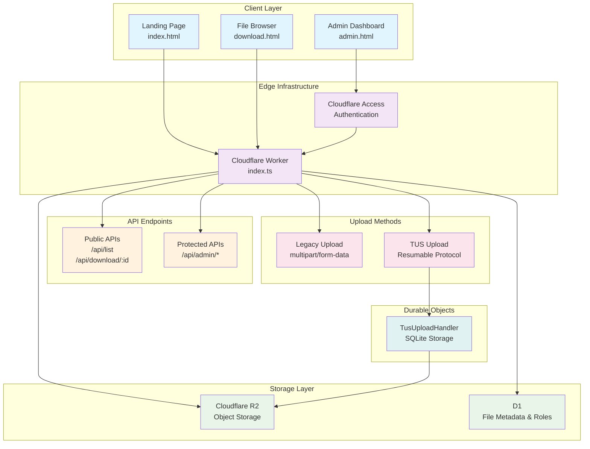

# File Sharing Platform

This is a file-sharing platform built on Cloudflare's edge infrastructure. It allows users to upload files with expiration dates and privacy controls, and provides an admin dashboard for file management.

The project is a serverless application with the following components:

- **Backend**: Cloudflare Workers written in TypeScript, using the Hono web framework.
- **File Storage**: Cloudflare R2 for object storage.
- **Metadata Storage**: Cloudflare D1 for storing file metadata and user roles.
- **Upload State**: Cloudflare Durable Objects with SQLite for TUS resumable upload state management.
- **Authentication**: Cloudflare Access for securing admin endpoints.
- **Frontend**: Vanilla JavaScript, HTML, and Tailwind CSS.

The application supports two upload methods: a legacy `multipart/form-data` upload and a modern, resumable upload using the [TUS protocol](https://tus.io/) with Durable Objects for reliable state persistence.

## Architecture

Built with a modern serverless stack:

- **Frontend**: Vanilla JavaScript, HTML5, Tailwind CSS
- **Backend**: Cloudflare Workers (TypeScript) with Hono framework
- **File Storage**: Cloudflare R2 Object Storage
- **Metadata and Roles**: Cloudflare D1 (SQLite)
- **Upload State**: Cloudflare Durable Objects (SQLite-backed) for TUS resumable uploads
- **Security**: Cloudflare Access for authentication



## Screenshots

Admin Dashboard


File Manager Admin View


## Quick Deploy

[](https://deploy.workers.cloudflare.com/?url=https://github.com/DavidJKTofan/cloudflare-file-sharing-platform)

## Building and Running

### Prerequisites

- [Cloudflare Account](https://dash.cloudflare.com/sign-up)

* [Node.js](https://nodejs.org/) (for Tailwind CSS builds) and [npm](https://www.npmjs.com/)
* [Wrangler CLI](https://developers.cloudflare.com/workers/wrangler/install-and-update/)

### Installation

1.  Clone the repository:
    ```bash
    git clone https://github.com/DavidJKTofan/cloudflare-file-sharing-platform.git
    ```
2.  Install dependencies:
    ```bash
    npm install
    ```

### Running Locally

To start the local development server, run:

```bash
npm run dev
```

This will start a local server that emulates the Cloudflare Workers environment. You will also need to create a `.dev.vars` file in the project root to configure your local Cloudflare resources (R2, D1).

### Building and Deploying

To build the application and deploy it to Cloudflare, run:

```bash
npm run deploy
```

This will bundle the Worker and deploy it to your Cloudflare account.

### Building CSS

The project uses Tailwind CSS for styling. To build the CSS, run:

```bash
npm run build:css
# npx @tailwindcss/cli -i ./input.css -o ./public/tailwind.css --minify
```

## Development Conventions

- **Code Style**: The project uses Prettier for code formatting. You can format the code by running `npx prettier --write .`.
- **Type Checking**: The project is written in TypeScript. You can run the type checker with `npx tsc`.
- **API**: The API is built with the Hono web framework. Routes are defined in `src/index.ts`, and the handlers are in the `src/api` directory.
- **Authentication**: Admin routes are protected with Cloudflare Access. The `authenticateUser` middleware in `src/index.ts` handles JWT validation.
- **Configuration**: The application is configured through `wrangler.jsonc` and environment variables. For local development, secrets are managed in a `.dev.vars` file.

## Configuration

### Environment Variables

| Name                                                        | Required | Purpose                                                                                                                                                                                               |
| ----------------------------------------------------------- | -------: | ----------------------------------------------------------------------------------------------------------------------------------------------------------------------------------------------------- |
| `R2_FILES` (binding)                                        |       ✅ | R2 bucket binding (object storage)                                                                                                                                                                    |
| `DB` (D1 binding)                                           |       ✅ | D1 database for file metadata and user roles                                                                                                                                                          |
| `TUS_UPLOAD_HANDLER` (DO binding)                           |       ✅ | Durable Object namespace for TUS resumable upload state (SQLite-backed)                                                                                                                               |
| `MAX_TOTAL_FILE_SIZE`                                       |       ⚪ | Maximum allowed file size (bytes)                                                                                                                                                                     |
| `MAX_DIRECT_UPLOAD`                                         |       ⚪ | Threshold for supporting legacy direct uploads                                                                                                                                                        |
| `R2_ACCESS_KEY_ID`, `R2_SECRET_ACCESS_KEY`, `R2_ACCOUNT_ID` |       ✅ | Required for generating [presigned URLs](https://developers.cloudflare.com/r2/api/s3/presigned-urls/) for downloads, using [aws4fetch](https://developers.cloudflare.com/r2/examples/aws/aws4fetch/). |

**To-Do:** Configure [Secrets](https://developers.cloudflare.com/workers/configuration/secrets/):

Local `.dev.vars` file for local development:

```
R2_ACCESS_KEY_ID="<R2_ACCESS_KEY_ID>"
R2_SECRET_ACCESS_KEY="<R2_SECRET_ACCESS_KEY>"
R2_ACCOUNT_ID="<CLOUDFLARE_ACCOUNT_ID>"
CF-Access-Client-Id="<ACCESS_SERVICE_TOKEN_CLIENT_ID>"
CF-Access-Client-Secret="<ACCESS_SERVICE_TOKEN_CLIENT_SECRET>"
ENVIRONMENT: "development"
```

For local development run:

```bash
npx wrangler dev --env development
```

## Metadata mapping (what is stored where)

This codebase stores metadata across multiple storage layers for optimal performance and reliability.

### D1 `files` table

The D1 database is the **source of truth** for all file metadata. The `files` table contains a comprehensive record of every file, including its properties, status, and location.

- `id` — UUID assigned at upload creation
- `name` — original filename
- `size` — file size in bytes
- `type` — MIME type
- `description` — free text
- `tags` — comma separated
- `status` — upload status (`pending`, `completed`, `error`)
- `r2_key` — the key of the file in the R2 bucket
- `hide_from_list` — `1` for true, `0` for false
- `uploaded_at` — ISO datetime (UTC)
- `expires_at` — ISO datetime (UTC)
- `checksum` — SHA-256 hex (64 hex chars)
- `upload_type` — `"multipart"` or `"tus"`
- `ip_address` — client IP address
- `user_agent` — client user-agent string
- `geo_asn`, `geo_colo`, `geo_country`, `geo_city`, `geo_timezone` — Cloudflare edge geo fields

### Durable Objects (SQLite)

TUS upload state is managed by the `TusUploadHandler` Durable Object with SQLite storage:

- **`upload_info` table** — stores upload metadata:
  - `upload_id`, `r2_key`, `multipart_upload_id`
  - `total_size`, `uploaded_size`
  - `filename`, `content_type`, `custom_metadata` (JSON)
  - `created_at`, `expires_at`, `is_completed`

- **`uploaded_parts` table** — tracks multipart parts:
  - `part_number`, `etag`, `size`

- **Automatic cleanup** — Durable Object alarms delete expired uploads after 7 days

### R2 Object `customMetadata` (Redundancy)

While D1 is the primary source of truth, essential metadata is also written to the `customMetadata` of each R2 object upon upload. This serves as a redundant backup and allows for direct inspection of object properties in the Cloudflare dashboard.

### List behavior

All file listing and search operations are performed by querying the `files` table in the D1 database. This provides a consistent and efficient way to filter, sort, and paginate through files.

- The `/api/list` endpoint queries for publicly visible files (`hide_from_list = 0`).
- The `/api/admin/list` endpoint queries all files and supports advanced filtering.

## Security Checklist

To prevent potential false positives at the `/api/admin/*` path, you may need to configure an [Exception](https://developers.cloudflare.com/waf/managed-rules/waf-exceptions/) or [Skip](https://developers.cloudflare.com/waf/custom-rules/skip/) rule for the Cloudflare WAF Managed Rules, specifically Rule ID `882b37d6bd5f4bf2a3cdb374d503ded0` (and maybe others too). Additionally, consider using [malicious uploads detection](https://developers.cloudflare.com/waf/detections/malicious-uploads/) for an extra layer of protection.

To prevent abuse or dictionary attacks, we recommend deploying a [Rate Limiting](https://developers.cloudflare.com/waf/rate-limiting-rules/) rule based on the URI path `/api/download/`.

**Protected Paths:**

- `/admin` - Admin dashboard
- `/api/admin` - Admin APIs
- `/api/admin/list` – Detailed file listing
- `/api/admin/upload` - File upload
- `/api/admin/upload-tus` - File resumable upload (tus)
- `/api/admin/cleanup` - Expired files cleanup
- `/api/admin/r2-info` - R2 dashboard access
- `/api/debug/jwt` – debug Access token

> **To-Do:** Protect `/admin` and `/api/admin` endpoints with [Cloudflare Access](https://developers.cloudflare.com/cloudflare-one/policies/access/). Additionally, review the [logout URL endpoint](https://developers.cloudflare.com/cloudflare-one/access-controls/access-settings/session-management/#log-out-as-a-user) in the `admin.html` file.

**Public Paths:**

- `/` - Landing page
- `/download.html` - File (user) download interface
- `/api/list` - Public file listing
- `/api/download/*` - File downloads (rate limiting recommended)

## API Reference

### Public Endpoints

#### `GET /api/list`

List publicly visible files (excludes hidden/expired)

**Query Parameters:**

- `search` - Search term
- `limit` - Max results (1-100)
- `cursor` - Pagination cursor

#### `GET /api/download/:fileId`

Redirects to a presigned URL to download the file by ID.

### Admin Endpoints (Protected)

#### `GET /api/admin/list`

List all files with comprehensive stats

**Query Parameters:**

- `search` - Search term
- `limit` - Max results (1-100)
- `cursor` - Pagination cursor
- `includeExpired` - Include expired files (default: true)
- `includeHidden` - Include hidden files (default: true)

#### `POST /api/admin/upload`

Upload file with metadata

**Form Data:**

- `file` - File to upload
- `description` - File description
- `tags` - Comma-separated tags
- `expiration` - ISO date string
- `hideFromList` - Boolean
- `checksum` - SHA-256 hash

#### `POST /api/admin/cleanup`

Delete all expired files

## Example API usage (curl)

Replace the hostname `files.automatic-demo.com` and `<VARIABLES>` with your deployment and credentials.

List public files (public endpoint):

```bash
curl -sS 'https://files.automatic-demo.com/api/list?limit=10' | jq
```

Download a file (the `-L` flag follows the redirect to the presigned URL):

```bash
curl -OJ -L 'https://files.automatic-demo.com/api/download/<fileId>'
```

Admin list (requires Cloudflare Access [cookie](https://developers.cloudflare.com/cloudflare-one/identity/authorization-cookie/) or [Service Token](https://developers.cloudflare.com/cloudflare-one/identity/service-tokens/)) because we created an [Access App](https://developers.cloudflare.com/cloudflare-one/applications/configure-apps/self-hosted-public-app/):

```bash
curl -H "CF-Access-Client-Id: <CLIENT_ID>" -H "CF-Access-Client-Secret: <CLIENT_SECRET>" "https://files.automatic-demo.com/api/admin/list?limit=50" | jq
```

Legacy upload (multipart form, admin-protected):

```bash
curl -v -H "CF-Access-Client-Id: <CLIENT_ID>" -H "CF-Access-Client-Secret: <CLIENT_SECRET>" \
  -F "file=@/path/to/local.bin" \
  -F "description=Test upload" \
  -F "tags=project,test" \
  -F "expiration=2026-01-01T00:00:00.000Z" \
  -F "hideFromList=false" \
  -F "checksum=<64-char-sha256-hex>" \
  "https://files.automatic-demo.com/api/admin/upload"
```

> Replace the `<your-name>.cloudflareaccess.com` endpoint on the [`public/admin.html`](public/admin.html) frontend, to trigger the logout properly within your own Zero Trust tenant.

## File Management

### File States

- **Public**: Visible in public file listing
- **Hidden**: Only accessible via direct link
- **Expired**: Past expiration date, marked for cleanup
- **Active**: Non-expired files

### Stats Breakdown

The admin dashboard shows:

- **Total Files**: All files in system
- **Active Files**: Non-expired files
- **Public/Hidden**: Visibility status
- **Storage Usage**: With progress bar

### File Structure

```
├── public/              	# Static assets
│   ├── admin.html       	# Admin dashboard HTML
│   ├── download.html    	# File download page HTML
│   ├── favicon.ico      	# Favicon
│   ├── favicon.png      	# Favicon
│   ├── index.html       	# Landing page HTML
│   ├── logo.png         	# Project logo
│   ├── tailwind.css     	# Compiled Tailwind CSS
│   ├── images/          	# Images used in the frontend
│   │   ├── admin-dashboard.png
│   │   ├── file-manager-public.png
│   │   └── file-manager.png
│   └── js/              	# Frontend JavaScript files
│       ├── admin.js     	# Admin dashboard JavaScript
│       └── download.js  	# Download page JavaScript
├── src/                 	# Cloudflare Worker source code
│   ├── index.ts         	# Main Worker entry point and API routes
│   ├── types.ts         	# TypeScript type definitions
│   ├── config.ts        	# Configuration validation with Zod
│   ├── auth.ts          	# Authentication and authorization middleware
│   ├── logger.ts        	# Structured logging utility
│   ├── api/             	# API handler modules
│   │   ├── download.ts  	# File download logic
│   │   ├── list.ts      	# File listing logic
│   │   ├── upload-tus.ts	# TUS resumable upload handlers
│   │   └── upload.ts    	# Legacy multipart upload logic
│   └── durable/         	# Durable Object classes
│       └── TusUploadHandler.ts  # TUS upload state management (SQLite)
├── .editorconfig        	# Editor configuration
├── .gitignore           	# Git ignore rules
├── .prettierrc          	# Prettier configuration
├── 1_create_user_roles.sql # D1 database schema for user roles
├── input.css            	# Tailwind CSS input file
├── LICENSE              	# Project license
├── package.json         	# Project dependencies and scripts
├── README.md            	# Project README file
├── tailwind.config.js   	# Tailwind CSS configuration
├── tsconfig.json        	# TypeScript configuration
├── worker-configuration.d.ts # Worker type definitions
└── wrangler.jsonc       	# Cloudflare Wrangler configuration
```

## TUS Resumable Upload Protocol

The platform implements the [TUS protocol](https://tus.io/) for reliable, resumable file uploads. Key features:

### Supported Extensions

- **creation** — Create new uploads
- **creation-with-upload** — Create and upload in single request
- **expiration** — Uploads expire after 7 days
- **termination** — Cancel/delete uploads

### Architecture

Each upload is managed by a dedicated Durable Object instance:

1. **POST `/api/admin/upload/tus`** — Creates upload, returns `Location` header
2. **PATCH `/api/admin/upload/tus/:uploadId`** — Upload chunks with `Upload-Offset`
3. **HEAD `/api/admin/upload/tus/:uploadId`** — Get current upload status
4. **DELETE `/api/admin/upload/tus/:uploadId`** — Cancel upload

### Benefits of Durable Objects

- **Consistency** — Single-threaded execution prevents race conditions
- **Persistence** — SQLite storage survives Worker restarts
- **Automatic cleanup** — Alarms delete expired uploads
- **Scalability** — Each upload isolated in its own DO instance

### Example TUS Upload (curl)

```bash
# Create upload
curl -X POST "https://files.automatic-demo.com/api/admin/upload/tus" \
  -H "CF-Access-Client-Id: <CLIENT_ID>" \
  -H "CF-Access-Client-Secret: <CLIENT_SECRET>" \
  -H "Tus-Resumable: 1.0.0" \
  -H "Upload-Length: 1048576" \
  -H "Upload-Metadata: filename $(echo -n 'test.bin' | base64)" \
  -D -

# Upload chunk (use Location from previous response)
curl -X PATCH "https://files.automatic-demo.com/api/admin/upload/tus/<uploadId>" \
  -H "CF-Access-Client-Id: <CLIENT_ID>" \
  -H "CF-Access-Client-Secret: <CLIENT_SECRET>" \
  -H "Tus-Resumable: 1.0.0" \
  -H "Upload-Offset: 0" \
  -H "Content-Type: application/offset+octet-stream" \
  --data-binary @test.bin
```

## Inspirations

Inspired by projects in the Cloudflare ecosystem:

- https://github.com/harshil1712/cf-access-demo
- https://r2explorer.com/
- https://github.com/james-elicx/cloudy
- https://github.com/EvickaStudio/r2-explorer
- https://github.com/conmcda/cloudflare-r2-desktop
- https://sftpcloud.io/ftp-and-sftp-using-cloudflare-r2

> These are third-party projects, use under your own responsibility.

---

## Disclaimer

This project is intended for educational and personal use. You are responsible for implementing appropriate security measures for production deployments. Always review and test security configurations before deploying to production.
